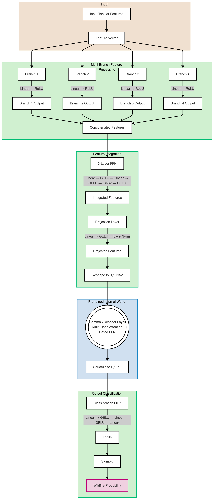

# Internal World Models for Wildfire Prediction

[](https://doi.org/10.1109/ACCESS.2024.3516784)
[](https://www.python.org/downloads/)
[](https://pytorch.org/)

## Using Pretrained "Internal World" Layers for Wildfire Prediction

This repository contains the implementation of a novel architecture for wildfire prediction described in our paper "Deep Learning with Pretrained 'Internal World' Layers: A Gemma 3-Based Modular Architecture for Wildfire Prediction".

### Overview

We introduce a modular architecture that integrates the middle layers of a pretrained large language model (Gemma 3) as a "internal world" component within a wildfire prediction network. Rather than training a wildfire model from scratch, our approach leverages the rich representations in Gemma 3's internal layers as a form of pretrained "world model" to enhance prediction performance.

The architecture processes tabular wildfire features through a custom feed-forward module that projects them into the hidden dimension required by Gemma 3's transformer blocks. The Gemma 3 layers remain frozen during training, preserving their pretrained representation power, while only the smaller input and output networks are trained.



## Project Structure

```
internal-world-wildfire/
├── data/
│   └── README.md                     # Instructions for dataset access
│
├── docs/
│   ├── model_architecture.png        # Diagram of the model architecture
│   └── results/                      # Figures from experiments
│       ├── confusion_matrix.png      # Confusion matrices for the models
│       ├── metrics_comparison.png    # Comparative metrics visualization
│       └── training_curves.png       # Learning curves for the models
│
├── models/
│   ├── __init__.py                   # Module initialization
│   ├── gemma3_internal_world.py      # Main implementation of our approach
│   ├── baseline_models.py            # Implementation of baseline models
│   └── custom_layers.py              # Custom layer implementations
│
├── utils/
│   ├── __init__.py                   # Module initialization
│   ├── data_utils.py                 # Data processing utilities
│   ├── evaluation.py                 # Evaluation metrics and utilities
│   └── visualization.py              # Plotting and visualization tools
│
├── experiments/
│   ├── train_internal_world.py       # Training script for our model
│   ├── train_baselines.py            # Training script for baseline models
│   └── benchmark.py                  # Full benchmark comparing all models
│
├── notebooks/
│   ├── data_exploration.ipynb        # Analysis of the Morocco wildfire dataset
│   ├── model_comparison.ipynb        # Interactive comparison of model results
│   └── feature_importance.ipynb      # Feature importance analysis
│
├── requirements.txt                  # Project dependencies
├── setup.py                          # Package installation
├── LICENSE                           # Project license
└── README.md                         # This file
```

## Key Components

### Gemma3 Internal World Model

The cornerstone of our approach is the `Gemma3InternalWorldModel` class, which integrates a pretrained Gemma 3 decoder layer as an "internal world" within our architecture:

```python
class Gemma3InternalWorldModel(nn.Module):
    """
    Multi-branch neural network with a frozen Gemma 3 internal world layer
    for wildfire prediction.
    
    Architecture:
    1. Input features split into 4 branches
    2. Each branch processed through its own FFN
    3. Branches concatenated to form a 1152-dimensional vector
    4. 3-layer FFN processing
    5. Projection to final 1152 dims
    6. Frozen Gemma3 partial decoder layer
    7. Final classification MLP
    """
    def __init__(self, n_features, gemma_path="google/gemma-3-1b-it"):
        # Initialization code...
        
    def forward(self, x):
        # Forward pass implementation...
```

### Custom Gemma Layer

When the actual Gemma model isn't available, we use a simulated layer that mimics its functionality:

```python
class SimulatedGemmaLayer(nn.Module):
    def __init__(self, hidden_size=1152):
        super().__init__()
        self.attn = nn.MultiheadAttention(hidden_size, num_heads=4, batch_first=True)
        self.ln1 = nn.LayerNorm(hidden_size)
        self.ln2 = nn.LayerNorm(hidden_size)
        self.ffn = nn.Sequential(
            nn.Linear(hidden_size, hidden_size * 4),
            nn.GELU(),
            nn.Linear(hidden_size * 4, hidden_size)
        )
        
    def forward(self, hidden_states, **kwargs):
        # Implementation of a transformer decoder layer
```

### Benchmark Models

We include various baseline models for comparison:

1. **Physics-Embedded Entropy Model**: Integrates principles from statistical mechanics with deep learning
2. **FFN Model**: Standard feed-forward neural network
3. **CNN Model**: Convolutional neural network for wildfire prediction
4. **FFN with Positional Encoding**: Feed-forward network enhanced with positional encodings

## Dataset

We evaluate our model on the Morocco Wildfire dataset, which includes:

- Meteorological variables (temperature, humidity, wind speed, etc.)
- Vegetation indices (NDVI and derivatives)
- Soil moisture data
- Time-lagged features (features from previous days)

The dataset spans from 2010 to 2022, with a binary classification target indicating wildfire occurrence.

## Results

Our evaluation demonstrates that the Internal World Model achieves superior performance compared to traditional approaches:

| Model | Accuracy | AUC | Precision | Recall | F1 Score | Parameters |
|-------|----------|-----|-----------|--------|----------|------------|
| Internal World Model | 0.8760 | 0.9344 | 0.8313 | 0.9433 | 0.8838 | 37,725,825 |
| Physics-Embedded Entropy | 0.7862 | 0.9219 | 0.7108 | 0.9652 | 0.8187 | 1,659,410 |
| FFN Model | 0.8499 | 0.9432 | 0.8023 | 0.9286 | 0.8608 | 113,025 |
| CNN Model | 0.8008 | 0.9418 | 0.7196 | 0.9856 | 0.8319 | 2,268,033 |
| FFN with Positional Encoding | 0.8980 | 0.9516 | 0.9157 | 0.8767 | 0.8957 | 18,849 |

## Usage

### Installation

```bash
# Clone the repository
git clone https://github.com/ayoubjadouli/internal-world-wildfire.git
cd internal-world-wildfire

# Install dependencies
pip install -r requirements.txt
```

### Training

```bash
# Train the Internal World Model
python experiments/train_internal_world.py --data_path path/to/dataset --epochs 5

# Train baseline models
python experiments/train_baselines.py --data_path path/to/dataset --model ffn

# Run the full benchmark
python experiments/benchmark.py --data_path path/to/dataset
```

### Inference

```python
import torch
from models.gemma3_internal_world import Gemma3InternalWorldModel

# Load the model
model = Gemma3InternalWorldModel(n_features=276)
model.load_state_dict(torch.load("path/to/saved/model.pt"))
model.eval()

# Make predictions
with torch.no_grad():
    predictions = model(input_features)
    probabilities = torch.sigmoid(predictions)
```

## Citation

If you use this code in your research, please cite our paper:

```bibtex
@article{jadouli2025deep,
  title={Deep Learning with Pretrained 'Internal World' Layers: A Gemma 3-Based Modular Architecture for Wildfire Prediction},
  author={Jadouli, Ayoub and El Amrani, Chaker},
  journal={IEEE Access},
  volume={13},
  pages={000--000},
  year={2025},
  publisher={IEEE},
  doi={10.1109/ACCESS.2025-00000}
}
```

## License

This project is licensed under the MIT License - see the LICENSE file for details.

## Acknowledgments

This research was financed entirely by Ayoub Jadouli's own funds.

## Contact

- Ayoub Jadouli - [ajadouli@uae.ac.ma](mailto:ajadouli@uae.ac.ma)
